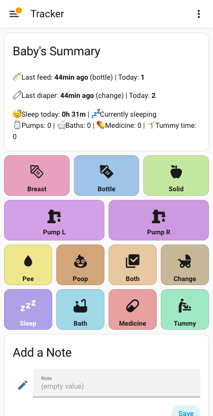
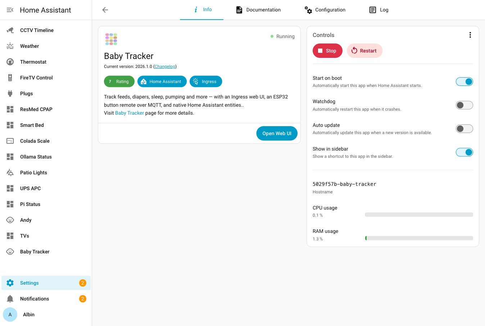
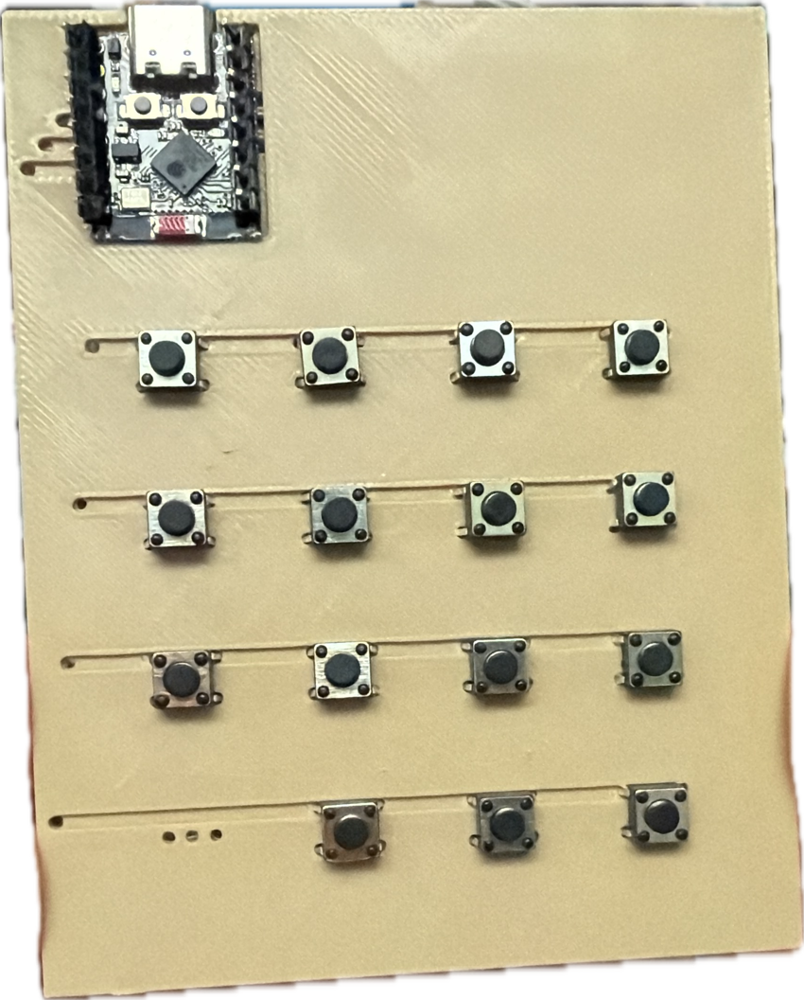
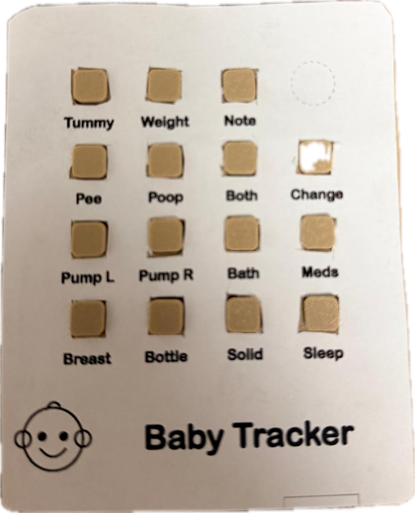

# hms-baby-tracker

[](https://www.buymeacoffee.com/aamat09)
[](LICENSE)
[](https://www.home-assistant.io/)


A self-contained **Home Assistant app/add-on** for newborn care tracking — feeds,
diapers, sleep, pumping, baths, medicine, tummy time, weight and notes — with a
one-tap Ingress web UI, local storage, pump reminders, and native HA entities.
No n8n, no external database. Pairs with the ESP32 button remote from the
[baby-tracker-suite](https://github.com/aamat09/baby-tracker-suite).

<p align="center">
  
  
</p>
<p align="center"><em>One-tap Ingress web UI (left) — runs as a native Home Assistant add-on (right): Ingress, MQTT discovery, start-on-boot, ~1% RAM.</em></p>

> **🎛️ Want the physical button remote?** The 3D-printed ESP32 remote that drives
> this dashboard is built in small batches — **[join the waitlist →](https://www.shmaestro.com/waitlist)**.

<p align="center">
  
  
</p>
<p align="center"><em>The physical remote, inside &amp; out — the wired 3D-printed board (left) + the snap-fit case with a 1:1 sticky-label faceplate (right); 15 buttons → MQTT → this add-on.</em></p>

## Features

- **One-tap logging** of 17 event types across 8 categories (feed/pump/diaper/
  sleep/bath/medicine/tummy time/weight + regular & special notes)
- **Ingress web UI** — the colorful button dashboard, summary stats, and journal,
  served right inside Home Assistant (no extra port, no auth to manage)
- **Native HA entities via MQTT discovery** — `sensor.baby_*`, a
  `binary_sensor` for "currently sleeping", and a `button.*` per action
- **Listens to the ESP32 remote** on `baby/remote/event` (and `baby/note`)
- **Pump reminders** — per-side timer (default 2h) → HA notifications
- **Self-contained** — SQLite under `/data`; survives restarts; optional external
  `database_url`
- **Silent until configured** — notifications only fire once you set
  `notify_targets`

## Install

1. **Settings → Add-ons** (shown as **Apps** on HA 2026.2+) → **Add-on Store** →
   ⋮ → **Repositories**.
2. Add: `https://github.com/hms-homelab/hms-baby-tracker`
3. Install **Baby Tracker**, set options (at least `timezone`), **Start**, then
   **Open Web UI**.

Requires an MQTT broker (e.g. the Mosquitto add-on) for the remote + native
entities; credentials are auto-discovered via the `mqtt` service. Full reference:
[`baby_tracker/DOCS.md`](baby_tracker/DOCS.md).

## Run standalone (without Home Assistant)

The same app ships as a plain Docker image — run it anywhere, no Supervisor:

```bash
# app + a Mosquitto broker for the ESP32 remote, data in ./data
docker compose up -d        # -> http://localhost:8099
```

or a single container:

```bash
docker run -d -p 8099:8099 -v "$PWD/data:/data" \
  -e TZ=America/New_York -e MQTT_HOST=192.168.1.10 \
  ghcr.io/hms-homelab/baby-tracker:latest
```

Config is via **env vars** instead of HA options: `TZ`, `PUMP_HOURS`, `MQTT_HOST`,
`MQTT_PORT`, `MQTT_USERNAME`, `MQTT_PASSWORD`, `DATABASE_URL`, `DATA_DIR`. Point
the ESP32 remote's MQTT at the broker and presses log straight in. (HA `notify`
targets only work when run as the add-on.) Images are multi-arch (amd64 + arm64)
and published on tagged releases.

## Architecture

```
ESP32-C3 remote ─MQTT─┐
HA UI (Ingress) ──────┤
REST POST /api/event ─┼─▶ Baby Tracker (Docker, /data SQLite)
                      │     ├─ FastAPI: ingest + stats engine + journal
                      │     ├─ APScheduler: pump reminders
                      │     └─ MQTT: discovery + state ─▶ HA sensors/buttons + notify
                      ▼
              HA entities + phone notifications
```

## Options

> **MQTT auto-configures** with the Mosquitto add-on; set `mqtt_host` as a **fallback** for an external broker.

| Option | Type | Default | Description |
|---|---|---|---|
| `timezone` | string | `America/New_York` | IANA TZ for "today" rollover + log timestamps |
| `pump_hours` | float | `2` | Hours after a pump event before the reminder fires |
| `notify_targets` | list | `[]` | HA `notify` service names (without `notify.`) for alerts |
| `mqtt_host` | string | `""` | **Fallback** broker. Blank = auto-discover the Mosquitto/Supervisor broker; set (e.g. `192.168.1.15`) for an external broker like EMQX |
| `mqtt_port` | port | `1883` | External broker port (fallback only) |
| `mqtt_username` | string | `""` | External broker username, if it requires auth |
| `mqtt_password` | password | `""` | External broker password, if it requires auth |
| `database_url` | string | `""` | Optional external DB; empty = built-in SQLite |

## Development

```bash
cd baby_tracker
python3 -m venv .venv && ./.venv/bin/pip install -r requirements.txt pytest
DATA_DIR=/tmp/baby MQTT_ENABLED=0 ./.venv/bin/uvicorn app.main:app --port 8099
./.venv/bin/python -m pytest -q     # stats parity tests
```

## Related Projects

- [baby-tracker-suite](https://github.com/aamat09/baby-tracker-suite) — the full suite (HA dashboards, n8n flows, ESP32 remote hardware/firmware)
- [hms-mm](https://github.com/hms-homelab/hms-mm) — dual ESP32-C3 WiFi SD-card bridge
- [hms-claude-mem](https://github.com/hms-homelab/hms-claude-mem) — semantic memory MCP server

## License

MIT License — see [LICENSE](LICENSE) for details.

## Support

If this project is useful to you, consider buying me a coffee!

[](https://www.buymeacoffee.com/aamat09)
