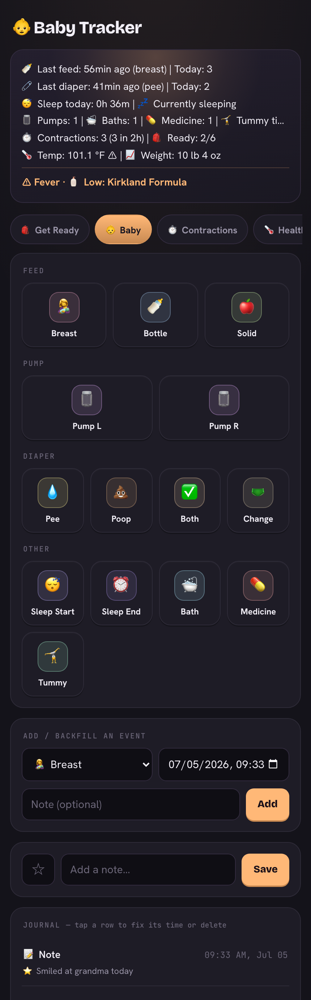
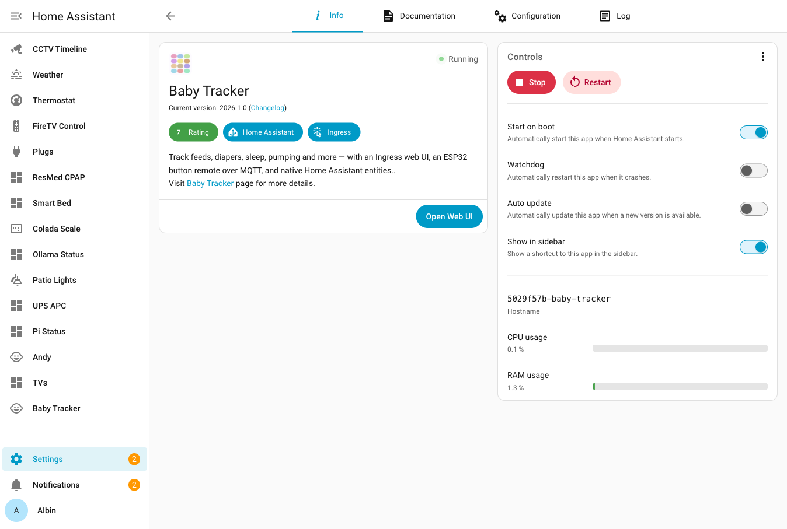
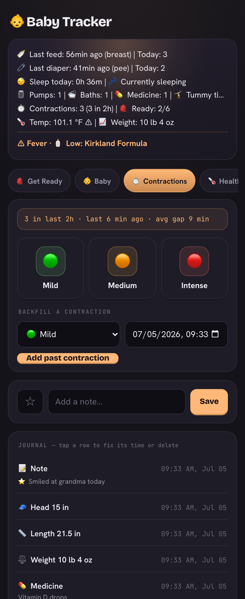
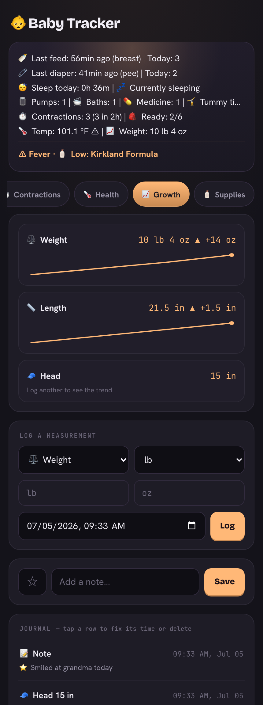
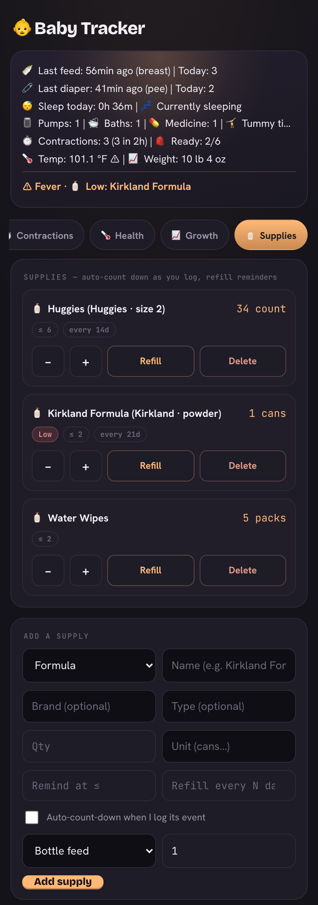
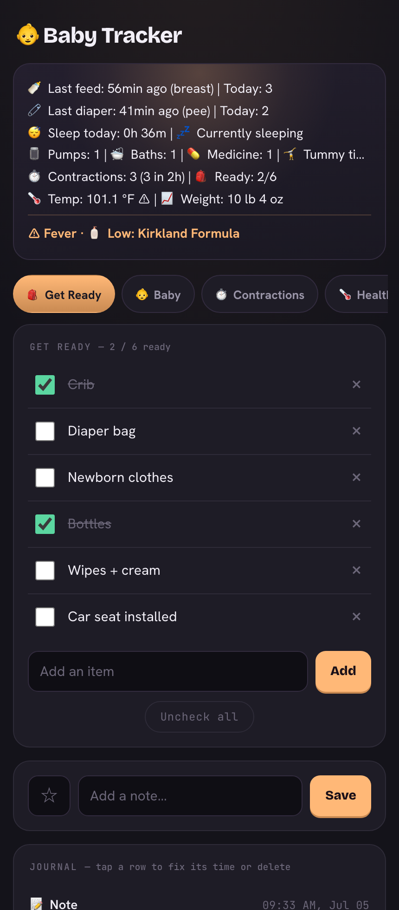
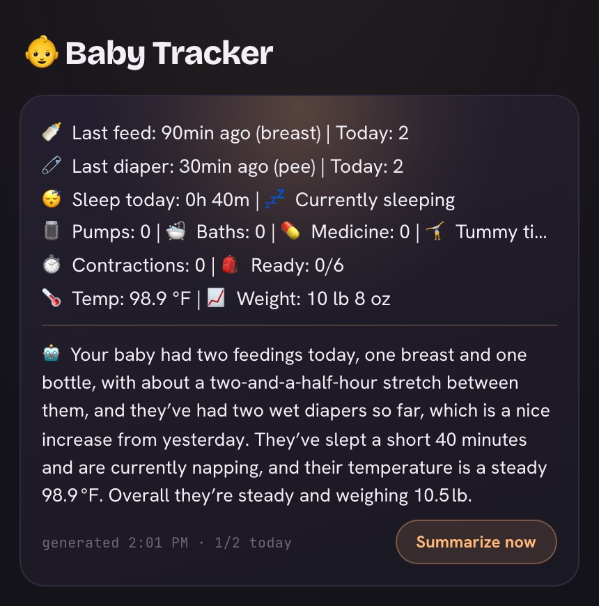

# Baby Tracker: Home Assistant Add-on (+ ESP32 MQTT remote)

[](https://www.buymeacoffee.com/aamat09)
[](LICENSE)
[](https://www.home-assistant.io/)


A self-contained Home Assistant app/add-on for the whole newborn journey: from
**labor contractions**, through everyday **feeds, diapers, sleep and pumping**, to
**health, growth and supply tracking**, with an optional **AI recap of the day**.
One-tap Ingress web UI, local storage, smart reminders, and native Home Assistant
entities. No n8n, no external database. It pairs with the optional ESP32 button
remote from the [baby-tracker-suite](https://github.com/aamat09/baby-tracker-suite).

<p align="center">
  
  
</p>
<p align="center"><em>The summary rolls up every tab (feeds, sleep, contractions, get-ready, temperature, weight) with an alert strip; runs as a native HA add-on with Ingress, MQTT discovery and start-on-boot.</em></p>

## Six tabs, one journey

A pinned **summary dashboard** sits on top and a pinned **journal** (logging
every tab's events) at the bottom. Between them, six tabs. Which one opens first
is configurable, so you can lead with **Contractions** or **Get Ready** before
the birth and switch to **Baby** after.

<p align="center">
  
  
  
  
</p>

- **🎒 Get Ready**: an editable prep checklist, seeded with popular suggestions
  (crib, diaper bag, newborn clothes, bottles, wipes, car seat), with a progress
  readout.
- **👶 Baby**: one-tap logging of feeds (breast / bottle / solid), pumping,
  diapers (pee / poop / both / change), sleep (start/stop toggle), bath, medicine
  and tummy time, plus add/backfill for missed events.
- **⏱️ Contractions**: big Mild / Medium / Intense buttons with a live "how many
  in the last 2h, last one, average gap" readout, and an optional on-device AI
  labor-stage assessment (via a local Ollama server).
- **🌡️ Health**: log a temperature (°C or °F) that's **flagged as a fever** past
  your threshold, plus symptom notes and medicine doses.
- **📈 Growth**: track weight (lb + oz or kg), length and head circumference,
  each with the change since the last reading and a trend sparkline.
- **🧴 Supplies**: a consumables inventory (formula, diapers, wipes, creams) that
  **auto-counts-down** as you log matching events and reminds you to refill by
  low-stock threshold and/or a days cadence.

## AI daily summary

A warm, plain-language recap of the baby's day, right in the summary card. An
automatic digest each morning plus a **Summarize now** button (2 per day). It
reads every tab and gently flags anything that stands out (a longer feed gap,
fewer diapers than yesterday, a fever).

<p align="center">
  
</p>

- **Private by design**: the model only ever receives an **anonymized digest**
  (counts, sleep, trends, last temp/weight). It never sees names, notes, or any
  free text.
- **On by default** via a free hosted service, or bring your own: point it at
  your own **Ollama**, or a **Claude / Gemini / OpenAI** key. The prompt is
  pre-filled and editable, and the code always appends the digest, so edits
  change the tone, not what's sent.
- A one-time in-app notice discloses the hosted default and links to the opt-out.
  Published as `sensor.baby_summary` + a retained `baby/summary` MQTT topic.

## Features

- **Summary dashboard** rolling up every tab, with a notifications strip that
  surfaces active alerts (fever, low / refill-due supplies) in one place, and the
  AI recap underneath.
- **Ingress web UI** served right inside Home Assistant: no extra port, no auth
  to manage. A shared note bar (with a ⭐ special toggle) works on every tab.
- **Native HA entities via MQTT discovery**: `sensor.baby_*` (last feed/diaper,
  today's counts, contractions today, get-ready progress, low supplies, the daily
  summary), a `binary_sensor` for "currently sleeping", and a `button.*` for each
  action.
- **One unified alerts bus**: every actionable alert (fever, supply low /
  refill-due, feed / pump reminders) fires on `baby/alert` with a `kind` field,
  so a single HA automation can notify any phone you like. Every stored event
  also fires on `baby/event`. See [`baby_tracker/DOCS.md`](baby_tracker/DOCS.md).
- **Smart reminders**: per-side pump timers (default 2h), a feed timer reset by
  each feed (default 3h), a daily supplies sweep, and an optional daily checklist
  reset.
- **Metric or imperial**: a `measurement_system` option sets the default unit
  pickers (°F/lb/in or °C/kg/cm); the unit is stored per entry either way.
- **Listens to the ESP32 remote** on `baby/remote/event` (and `baby/note`), and
  drives its OLED (last feed/pump + next-pump reminder).
- **Self-contained**: SQLite under `/data`, survives restarts, with an optional
  external `database_url` (PostgreSQL).

> **Want the physical button remote?** The 3D-printed ESP32 remote that drives
> this dashboard has build details, photos and a demo on its
> **[project page](https://shmaestro.com/projects/baby-tracker)**. Rather not print
> and solder your own? A pre-built unit is **[available here](https://shop.shmaestro.com/products/baby-tracker)**.
> Either way the add-on works fully standalone.

<p align="center">
  
</p>
<p align="center"><em>The companion ESP32 Baby Remote: one-tap logging over MQTT, with a 0.96" OLED showing last feed, last pump and the next-pump reminder. Optional; the add-on works on its own.</em></p>

## Install

1. **Settings → Add-ons** (shown as **Apps** on HA 2026.2+) → **Add-on Store** →
   ⋮ → **Repositories**.
2. Add: `https://github.com/hms-homelab/hms-baby-tracker`
3. Install **Baby Tracker**, set options (at least `timezone`), **Start**, then
   **Open Web UI**.

You'll want an MQTT broker (e.g. the Mosquitto add-on) for the remote and the
native entities. Credentials are auto-discovered through the `mqtt` service. Full
reference: [`baby_tracker/DOCS.md`](baby_tracker/DOCS.md).

## Run standalone (without Home Assistant)

The same app ships as a plain Docker image, so you can run it anywhere with no
Supervisor:

```bash
# app + a Mosquitto broker for the ESP32 remote, data in ./data
docker compose up -d        # -> http://localhost:8099
```

or a single container:

```bash
docker run -d -p 8099:8099 -v "$PWD/data:/data" \
  -e TZ=America/New_York -e MQTT_HOST=192.168.1.10 \
  ghcr.io/hms-homelab/baby-tracker:latest
```

Config is via **env vars** instead of HA options: `TZ`, `PUMP_HOURS`,
`FEED_HOURS`, `MQTT_HOST`, `MQTT_PORT`, `MQTT_USERNAME`, `MQTT_PASSWORD`,
`DATABASE_URL`, `DATA_DIR`, `DEFAULT_TAB`, `MEASUREMENT_SYSTEM`,
`FEVER_THRESHOLD_C`, `SUPPLY_REMINDER_HOUR`, `CHECKLIST_RESET_HOUR`,
`SUMMARY_ENABLED`, `SUMMARY_PROVIDER`, `SUMMARY_HOSTED_URL`, `SUMMARY_API_KEY`.
Point the ESP32 remote's MQTT at the broker and presses log straight in;
`baby/event` and `baby/alert` fire the same way for your own MQTT automations.
Images are multi-arch (amd64 + arm64).

## Architecture

```
ESP32-C3 remote ─MQTT─┐
HA UI (Ingress) ──────┤
REST POST /api/event ─┼─▶ Baby Tracker (Docker, /data SQLite or Postgres)
                      │     ├─ FastAPI: 6-tab UI, ingest, stats, journal,
                      │     │           supplies, checklist, growth, AI summaries
                      │     ├─ APScheduler: pump/feed + supply + checklist + summary jobs
                      │     └─ MQTT: discovery + baby/state + baby/event + baby/alert
                      ▼
        HA entities + your automations
                      │
      AI summary ─────┘  anonymized digest ─▶ hosted proxy / your Ollama / API key
```

## Options

> **MQTT auto-configures** with the Mosquitto add-on; set `mqtt_host` as a fallback for an external broker.

| Option | Type | Default | Description |
|---|---|---|---|
| `timezone` | string | `America/New_York` | IANA TZ for "today" rollover and log timestamps |
| `default_tab` | list | `baby` | Which tab opens first (`get_ready`, `baby`, `contractions`, `health`, `growth`, `supplies`) |
| `measurement_system` | list | `imperial` | Default units: `imperial` (°F, lb/oz, in) or `metric` (°C, kg, cm) |
| `fever_threshold_c` | float | `38.0` | Temperature (°C) at/above which the Health tab flags a fever |
| `summary_enabled` | bool | `true` | AI daily summary in the summary card; turn off to keep everything local/off |
| `summary_provider` | list | `hosted` | `hosted` proxy, your own `ollama`, or `anthropic` / `openai` / `gemini` |
| `summary_hosted_url` / `summary_api_key` / `summary_prompt` | string | (built-in) | Hosted URL, API key for the paid providers, and the editable recap instruction |
| `pump_hours` | float | `2` | Hours after a pump event before the reminder fires |
| `feed_hours` | float | `3` | Hours after the last feed before the feed reminder fires |
| `supply_reminder_hour` | int | `9` | Local hour for the daily low-stock / refill-due sweep |
| `checklist_reset_hour` | int | `0` | Local hour to auto-uncheck the Get Ready list (`0` = off) |
| `mqtt_host` | string | `""` | Fallback broker. Blank auto-discovers the Mosquitto/Supervisor broker |
| `mqtt_port` | port | `1883` | External broker port (fallback only) |
| `mqtt_username` / `mqtt_password` | string | `""` | External broker credentials, if it requires auth |
| `database_url` | string | `""` | Optional external PostgreSQL; empty uses the built-in SQLite |
| `ollama_*` | | off | Optional local-LLM contraction assessment (see DOCS) |

## Development

```bash
cd baby_tracker
python3 -m venv .venv && ./.venv/bin/pip install -r requirements.txt pytest
DATA_DIR=/tmp/baby MQTT_ENABLED=0 ./.venv/bin/uvicorn app.main:app --port 8099
./.venv/bin/python -m pytest -q     # stats parity + feature tests
```

## Related Projects

- [baby-tracker-suite](https://github.com/aamat09/baby-tracker-suite): the full suite (HA dashboards, n8n flows, ESP32 remote hardware/firmware).
- [hms-mm](https://github.com/hms-homelab/hms-mm): dual ESP32-C3 WiFi SD-card bridge.
- [hms-claude-mem](https://github.com/hms-homelab/hms-claude-mem): semantic memory MCP server.

## License

MIT License. See [LICENSE](LICENSE) for details.

## Support

If this project is useful to you, consider buying me a coffee!

[](https://www.buymeacoffee.com/aamat09)
